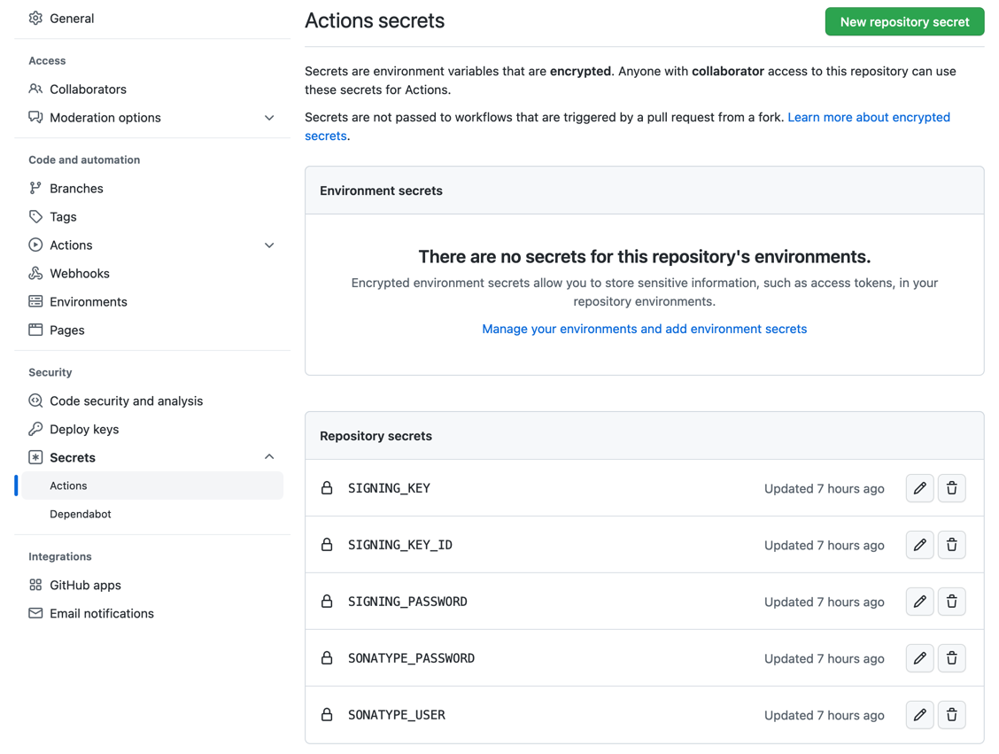
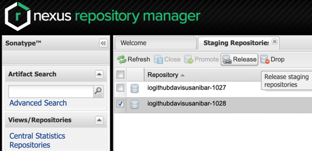

# CI CD

## Introduction

- `Semantic release` helps us to automate the whole package release workflow including:
  - Determining the next version number,
  - Generating the release notes,
  - Publishing the package.
- New features and fixes are `immediately` available to users on the Staging repository.
- Use formalized `commit message convention` to document changes in the codebase.

## Credentials

Semantic release requires several credentials in order to automate publishing actions.

### Github Token

Github workflow use this environment variable `${{ secrets.GITHUB_TOKEN }}` for [Automatic token authentication](https://docs.github.com/en/actions/security-guides/automatic-token-authentication#about-the-github_token-secret
).

### Public/Private Key

GPG keys are used to sign the release artifacts.

```shell
$ gpg --full-gen-key
$ gpg --list-keys
$ gpg --keyserver keyserver.ubuntu.com --send-keys 103EEE97
$ gpg --export-secret-keys 103EEE97 | base64
```

Configure values for:
```properties
SIGNING_KEY_ID = 103EEE97
SIGNING_PASSWORD = password
SIGNING_KEY = gpg --export-secret-keys 103EEE97 | base64
```

### Actions Secrets

Create these actions secrets used by release process:



## Repository Manager

The artifacts are deployed to Sonatype OSSRH (Sonatype Open Source Software Repository Manager).

These are the repositories availables:
- Snapshots: https://s01.oss.sonatype.org/content/repositories/snapshots
- Staging: https://s01.oss.sonatype.org/content/repositories/staging
- Releases: https://s01.oss.sonatype.org/content/repositories/releases


## Release Process

- Every push to pre-release branches `beta` deploys an artifact to the `snapshots repository` and it's ready to be used.
- Every push to release branches `main`, `maintenance` deploys an artifact to the `staging repository` and it's ready to be used.
- If there are no restrictions/problems/impediments then the next step is to release the artifact to `maven central`.
- There is a `manual release` process to send the libraries to `maven central`.
- In case of issues/problems/errors there is also a `drop` option available to delete the release version.
- Once a component has been released and published to the Central Repository, it cannot be altered.



## Artifacts

Once published, the artifacts can be downloaded from the following locations:

- Github Artifacts:
  - https://github.com/substrait/sustrait-java/releases

- Sonatype OSSRH Artifacts:
  - https://s01.oss.sonatype.org/content/repositories/{snapshots,staging,releases}/substrait/substrait-java/core/1.0.0/

## Branches Configuration

- Regular development of new features and functionality is done by creating PRs into the `main` branch

  After your PR is merged to main branch, you could see the new libraries available in the Sonatype staging environment.


- To create a maintenance release please create a branch name with this pattern `+([0-9])?(.{+([0-9]),x}).x`.
  Example:
  ```shell
  # Current version on production: 2.5.7, version planned to use for maintenance: 2.1.7
  $ git checkout -b 2.1.x v2.1.7 # for fix
  $ git checkout -b 2.x v2.1.7 # for maintenance


- In case you need to experiment with breaking changes for a new feature, you can use a pre-release branch.
  Example:
  ```shell
  # Current version on production: 2.5.7, version planned to use for maintenance: 2.1.7
  $ git checkout -b new_feature_lots_changes beta
  ```
  After your PR is merged to beta branch, you could see the new libraries available at Sonatype snapshots environment.


Branches configuration:

```json
  "branches": [
    // maintenances (also generate release)
    { "name": "+([0-9])?(.{+([0-9]),x}).x" },
    // release
    { "name": "main" },
    { "name": "next" },
    { "name": "next-major" },
    // pre-release
    { "name": "beta", "prerelease": true },
    { "name": "alpha", "prerelease": true }
  ],
```

## Release Validation

### GPG Signatures

#### Getting Signature

The ID of the key used to sign the artifacts is 103EEE97. The long-form ID is 0x9B445A3D103EEE97.

You can download and import it with:

````shell
$ gpg --keyserver keyserver.ubuntu.com --recv-keys 103EEE97
gpg: key 9B445A3D103EEE97: "Subsrait Java (Key to sign Java artifacts) <subsrait@io.com>" imported
gpg: Total number processed: 1
gpg:               imported: 1
````

#### Verifying the Signature

Download Java JAR/POM files and validate the signature of them:

```shell
# Staging Environment - 1.0.0 version
# JAR
$ wget https://s01.oss.sonatype.org/content/repositories/staging/io/substrait/core/1.0.0/core-1.0.0.jar
$ wget https://s01.oss.sonatype.org/content/repositories/staging/io/substrait/core/1.0.0/core-1.0.0.jar.asc
$ gpg --verify /Users/substrait/core-1.0.0.jar.asc
gpg: assuming signed data in '/Users/substrait/core-1.0.0.jar'
gpg: Signature made Fri Nov 18 08:52:19 2022 -05
gpg:                using RSA key 9B445A3D103EEE97
gpg: Good signature from "Subsrait Java (Key to sign Java artifacts) <subsrait@io.com>" [ultimate]
# POM
$ wget https://s01.oss.sonatype.org/content/repositories/staging/io/substrait/core/1.0.0/core-1.0.0.pom
$ wget https://s01.oss.sonatype.org/content/repositories/staging/io/substrait/core/1.0.0/core-1.0.0.pom.asc
$ gpg --verify /Users/substrait/core-1.0.0.pom.asc
gpg: assuming signed data in '/Users/substrait/core-1.0.0.pom'
gpg: Signature made Fri Nov 18 08:52:18 2022 -05
gpg:                using RSA key 9B445A3D103EEE97
gpg: Good signature from "Subsrait Java (Key to sign Java artifacts) <subsrait@io.com>" [ultimate]


# Maven Central - 1.0.0 version
# JAR
$ wget https://s01.oss.sonatype.org/content/repositories/release/io/substrait/core/1.0.0/core-1.0.0.jar
$ wget https://s01.oss.sonatype.org/content/repositories/release/io/substrait/core/1.0.0/core-1.0.0.jar.asc
$ gpg --verify /Users/substrait/core-1.0.0.jar.asc
gpg: assuming signed data in '/Users/substrait/core-1.0.0.jar'
gpg: Signature made Fri Nov 18 08:52:19 2022 -05
gpg:                using RSA key 9B445A3D103EEE97
gpg: Good signature from "Subsrait Java (Key to sign Java artifacts) <subsrait@io.com>" [ultimate]
# POM
$ wget https://s01.oss.sonatype.org/content/repositories/release/io/substrait/core/1.0.0/core-1.0.0.pom
$ wget https://s01.oss.sonatype.org/content/repositories/release/io/substrait/core/1.0.0/core-1.0.0.pom.asc
$ gpg --verify /Users/substrait/core-1.0.0.pom.asc
gpg: assuming signed data in '/Users/substrait/core-1.0.0.pom'
gpg: Signature made Fri Nov 18 08:52:18 2022 -05
gpg:                using RSA key 9B445A3D103EEE97
gpg: Good signature from "Subsrait Java (Key to sign Java artifacts) <subsrait@io.com>" [ultimate]
```

### How to use Artifacts

#### Staging Environment

Maven:
```xml
    <repositories>
        <repository>
            <id>sonatype-staging</id>
            <url>https://s01.oss.sonatype.org/content/groups/staging</url>
        </repository>
    </repositories>

    <dependencies>
      ...
      <dependency>
          <groupId>io.substrait</groupId>
          <artifactId>core</artifactId>
          <version>1.0.0</version>
      </dependency>
      <dependency>
          <groupId>io.substrait</groupId>
          <artifactId>isthmus</artifactId>
          <version>1.0.0</version>
      </dependency>
      ...
    </dependencies>
```

Gradle
```groovy
repositories {
    maven {
        url = uri("https://s01.oss.sonatype.org/content/groups/staging")
    }
}
dependencies {
    ...
    implementation 'io.substrait:core:1.0.0'
    implementation 'io.substrait:isthmus:1.0.0'
    ...
}
```

#### Maven Central

Maven:
```xml
    <dependencies>
      ...
      <dependency>
          <groupId>io.substrait</groupId>
          <artifactId>core</artifactId>
          <version>1.0.0</version>
      </dependency>
      <dependency>
          <groupId>io.substrait</groupId>
          <artifactId>isthmus</artifactId>
          <version>1.0.0</version>
      </dependency>
      ...
    </dependencies>
```

Gradle
```groovy
dependencies {
    ...
    implementation 'io.substrait:core:1.0.0'
    implementation 'io.substrait:isthmus:1.0.0'
    ...
}
```

## Q&A

#### 1. What will be happened if I merge something on main branch and for some reason the process has finished with errors or the Job has been completed with failures messages?

The CI process will automatically create a Github issue to track the failure.

```shell
[10:30:55 PM] [semantic-release] [@semantic-release/github] › ℹ  Created issue #3: https://github.com/substrait/sustrait-java/issues/3.
```


#### 2. Is it possible to release a library with a custom version (i.e.: 3.2.9.RC1, 5.0.0.M1)?

We are using Sonatype OSSRH, the destination repository (`snapshots / staging / release`) is based on the name of the artifacts:

- For a library name as `1.4.3-XXXXX-SNAPSHOT` -> it is going to be deployed to Snapshots repository
- For a library name as `1.4.3-XXXXX-SNAPSHOT.YYYY` -> it is going to be deployed to Staging/Releases repository
- For a library name as `1.4.3-XXXXX` -> it is going to be deployed to Staging/Releases repository
- For a library name as `1.4.3` -> it is going to be deployed to Staging/Releases repository

#### 2. How many days do I have to approve the artifacts on the Staging repository?

Please review [OSSRH-86341](https://issues.sonatype.org/browse/OSSRH-86341) and [OSSRH-24751](https://issues.sonatype.org/browse/OSSRH-24751).
